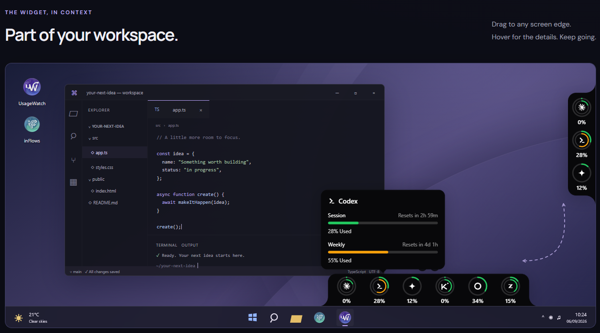

# UsageWatch

A Windows tray app and desktop widget that shows how much of your AI
subscription quota is left. Usage is read from each provider's server-side
API, so the numbers are correct across all of your machines.



Built with **Tauri 2, React 18, TypeScript, Tailwind CSS 4 and Vite**.

## Supported providers

| Provider | Sign-in | Shows |
|---|---|---|
| Claude | in-app OAuth (paste code) | session, weekly and per-model limits, extra usage |
| Codex / ChatGPT | in-app OAuth (browser callback) | session, weekly and per-model limits, reset credits |
| Gemini *(experimental)* | in-app OAuth (browser callback) | Pro / Flash / Lite quotas |
| Kimi Code | API key | session and weekly limits |
| OpenRouter | API key | credit balance |
| z.ai Coding Plan | API key | session, weekly and monthly quotas |

You can track several accounts of the same provider. Tokens and API keys are
encrypted with Windows DPAPI and never written to plain-text configuration.
Several endpoints are undocumented; see [docs/PROVIDERS.md](docs/PROVIDERS.md).

Missing your provider? See [Adding a provider](CONTRIBUTING.md#adding-a-provider).

## Install

Download the latest `UsageWatch_<version>_x64-setup.exe` from
[Releases](https://github.com/Presoon/usagewatch/releases). The installer is not
code-signed yet, so Windows SmartScreen may show an "unknown publisher" warning.

## Build from source

Requires Node.js 20+, Rust (MSVC toolchain), Visual Studio Build Tools 2022
(*Desktop development with C++*) and the WebView2 Runtime.

```sh
npm ci
npm run tauri dev     # run the app
npm run dev:mock      # UI only, demo data, no Rust build
npm run tauri build   # NSIS installer in src-tauri/target/release/bundle/nsis/
```

Development builds keep incremental compilation in `src-tauri/target/`. To
reclaim disk space run
`cargo clean --manifest-path src-tauri/Cargo.toml --profile dev`
(the next build starts from scratch).

## Contributing

See [CONTRIBUTING.md](CONTRIBUTING.md). Security issues: [SECURITY.md](SECURITY.md).
Releases: [docs/RELEASING.md](docs/RELEASING.md). Landing page: [docs/WEBSITE.md](docs/WEBSITE.md).

## License

[MIT](LICENSE)
